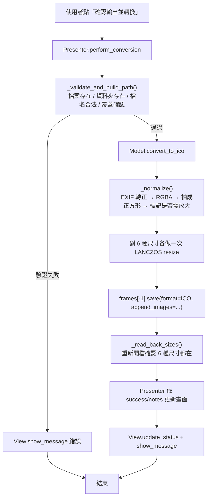

# image2ico — 圖片轉 ICON 工具 v1

## Overview

把任意常見圖片（PNG / JPEG / BMP / GIF / WebP / TIFF / ICO）轉成 Windows 可用的多尺寸 `.ico` 檔。
桌面 GUI 程式，以 ttkbootstrap 建構，採 MVP 分層。核心價值在於**保證輸出可直接當作 Windows 應用程式圖示**：
不論來源圖是什麼長寬比、多小張、什麼色彩模式，輸出一律包含 16 / 32 / 48 / 64 / 128 / 256 px 六種正方形尺寸。

非正方形來源會置中補上透明邊，小於 256px 的來源會以 LANCZOS 放大到 256px，兩種情況都會在 UI 上明確告知使用者。
寫檔後程式會重新讀回 `.ico` 驗證尺寸真的都在，確認失敗才回報成功。

## Architecture

單檔 MVP（Model–View–Presenter）。View 不含商業邏輯，Model 不接觸任何 UI 元件，兩者只透過 Presenter 溝通。

| 層 | 類別 | 位置 | 職責 |
| --- | --- | --- | --- |
| Model | `IconConverterModel` | [image2ico.py](image2ico.py) | 圖片正規化與 `.ico` 寫入、寫後驗證。純函式式，可單獨測試 |
| View | `IconConverterView` | [image2ico.py](image2ico.py) | 繼承 `ttk.Window`，建構畫面、顯示對話框、更新狀態列 |
| Presenter | `IconConverterPresenter` | [image2ico.py](image2ico.py) | 綁定按鈕事件、輸入驗證、覆蓋確認、呼叫 Model 並把結果餵回 View |



### 為什麼不直接把原圖丟給 Pillow

`img.save(path, format='ICO', sizes=[...])` 有兩個會靜默出錯的行為，這也是舊版最主要的 bug：

1. **大於原圖的尺寸會被丟棄。** 100×100 的來源指定六種尺寸，實際只會寫入 16/32/48/64，沒有 128/256，
   但 `save()` 不會報錯，UI 因此謊報成功。
2. **非正方形來源會產生非正方形 frame。** 800×400 的來源會寫出 256×128、64×32 等 frame，
   Windows 顯示時會變形，且完全不理會你指定的 sizes。

因此 Model 先把來源整理成「至少 256px 的正方形 RGBA」，再對每個尺寸各做一次 resize，
用 `append_images` 一次寫入，最後讀回驗證。

## Directory structure

```
image2ico/
├── image2ico.py             # 主程式：Model / View / Presenter 三個類別 + main()
├── test_convert.py          # 驗收測試（小圖、非正方形、調色盤、正常、非圖片檔、隨附 App 圖示）
├── Image2Ico.spec           # PyInstaller onefile 打包設定
├── requirements.txt         # 相依套件（版本精確鎖定）
├── image2ico_icon.ico       # 應用程式圖示（16/32/48/64/128/256，六種尺寸齊全）
├── image2ico_icon.png       # 圖示的 1024×1024 原始圖
├── CLAUDE.md                # 本專案的環境與指令備忘
├── README.md                # 本文件
├── dist/                    # PyInstaller 輸出（Image2Ico.exe）
└── build/                   # PyInstaller 中繼檔，可安全刪除
```

## Setup & run

環境：Windows + conda env `app`（Python 3.12.13），與 [webp2image](../webp2image/README.md) 共用同一個環境。
本機 conda 不在 PATH 上，一律以絕對路徑呼叫該環境的 `python.exe`，不要 `conda activate`。
下面的路徑是 MSI-Alex 這台的；換一台機器時 env 名稱一樣是 `app`，只有 anaconda 根目錄要跟著換。

```powershell
# 一次性建立環境（相依版本鎖在 requirements.txt）
& "C:\Users\Alex\anaconda3\Scripts\conda.exe" create -n app python=3.12 -y
& "C:\Users\Alex\anaconda3\envs\app\python.exe" -m pip install -r requirements.txt

# 開發執行
& "C:\Users\Alex\anaconda3\envs\app\python.exe" image2ico.py

# 執行測試（應輸出 6 個 PASS）
& "C:\Users\Alex\anaconda3\envs\app\python.exe" test_convert.py

# 打包成單一 exe（產物：dist\Image2Ico.exe）
& "C:\Users\Alex\anaconda3\envs\app\python.exe" -m PyInstaller --clean --noconfirm Image2Ico.spec
```

平台備註：

- 僅在 Windows 上驗證過。`ctypes.windll.shell32.SetCurrentProcessExplicitAppUserModelID` 只在 win32 執行，
  其他平台會跳過，但視窗圖示與工作列圖示的行為未測試。
- 打包採 **onefile**，啟動約 2–3 秒，尚在可接受範圍，因此不改用 onedir。在只裝 [requirements.txt](requirements.txt) 三個套件的 `app` 環境實測產物為 20.5 MB（2026-08-24）；先前在 `app_plot` 環境是 28.1 MB，差的 7.6 MB 是那個環境裡 numpy 等無關套件被一併收進 bundle。
- `.spec` 內以 `collect_data_files('ttkbootstrap')` 收集 ttkbootstrap 2.x 的字型與圖示資產。
  少了這段，打包出來的 exe 一啟動就會因找不到 `assets/icons/bootstrap.ttf` 而閃退。

## Dependencies

版本以 [requirements.txt](requirements.txt) 為準，精確鎖定成 `app` 環境的實測版本。

| 套件 | 版本 | 用途與選用理由 |
| --- | --- | --- |
| `ttkbootstrap` | 2.2.0 | 讓原生 tkinter 有現代外觀；使用 `cosmo` 主題。純 tkinter 的預設樣式過於老舊 |
| `pillow` | 12.3.0 | 圖片讀取、色彩模式轉換、LANCZOS 縮放與 `.ico` 寫入。是 Python 生態唯一成熟的選擇 |
| `pyinstaller` | 6.22.0 | 打包成單一 exe，讓沒有 Python 的使用者也能執行 |

標準函式庫：`tkinter`（GUI 基礎）、`ctypes`（設定 Windows AppUserModelID）、`pathlib` / `os` / `sys`。

## Configuration

本專案**沒有設定檔、沒有環境變數、也不使用任何 API 金鑰**，因此沒有需要保護的機密。
所有可調參數都是 [image2ico.py](image2ico.py) 頂端或類別內的常數：

| 常數 | 預設值 | 說明 |
| --- | --- | --- |
| `APP_VERSION` | `"1"` | 顯示在視窗標題（`圖片轉 ICON 工具 v1`） |
| `ICON_NAME` | `"image2ico_icon.ico"` | 視窗圖示檔名；同時列在 `.spec` 的 `datas` 與 `icon` |
| `APP_ID` | `"prof_program.image2ico.converter.v1"` | Windows AppUserModelID，決定工作列圖示是否正確分組 |
| `INVALID_NAME_CHARS` | `<>:"/\|?*` | 輸出檔名的字元黑名單 |
| `IconConverterModel.ICON_SIZES` | 16/32/48/64/128/256 | 輸出的 `.ico` 內含尺寸 |
| `IconConverterModel.TARGET_SIZE` | `256` | 正規化後的最小邊長；來源小於此值會被放大 |

`image2ico_icon.ico` 自己也含 16/32/48/64/128/256 六種尺寸，[test_convert.py](test_convert.py) 的 `check_shipped_icon()` 每次跑測試都會驗一次——
本程式的產物就是 `.ico`，隨附的圖示若不合格會很難看。

`resource_path()` 負責路徑解析：frozen 時走 `sys._MEIPASS`，開發時以本檔案所在目錄為基準
（刻意不用 `os.path.abspath(".")`，避免從其他工作目錄啟動時找不到圖示）。
