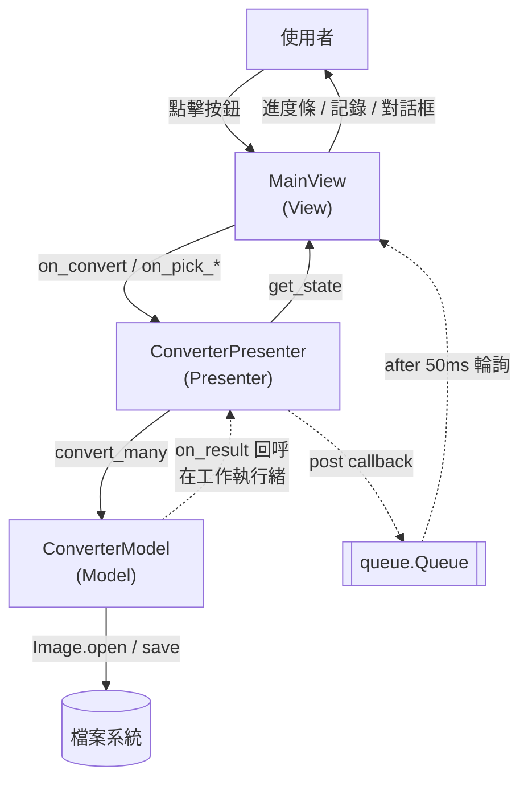

# webp2image — WebP 批次轉圖片工具 v1

## Overview

把 `.webp` 圖檔批次轉換成常見圖片格式的 Windows 桌面小工具，預設輸出 **PNG**，另支援 JPEG / BMP / TIFF。介面用 tkinter + ttkbootstrap，可選單一檔案、多個檔案或整個資料夾（可含子資料夾），轉換在背景執行緒進行，過程有進度條與逐筆訊息記錄。整個程式以 MVP（Model-View-Presenter）架構寫在單一 `webp2image.py` 中，方便直接用 PyInstaller 打包成單一 `.exe` 交付。

## Architecture

採 **MVP（Model-View-Presenter）**。三層都在 [webp2image.py](webp2image.py) 內，但邊界明確：View 與 Model 之間沒有任何直接依賴，所有互動都經過 Presenter。

| 層 | 類別 | 職責 | 禁止事項 |
| --- | --- | --- | --- |
| Model | `ConverterModel` | 展開來源清單、單檔／批次轉換、透明度處理 | 不 import tkinter，不知道 UI 存在 |
| View | `MainView`（繼承 `ttkbootstrap.Window`） | 建立畫面、蒐集輸入（`get_state()`）、顯示結果 | 不做任何判斷，事件一律轉交 Presenter |
| Presenter | `ConverterPresenter` | 驗證輸入、開背景執行緒、把結果推回 View | 唯一同時認識 Model 與 View 的角色 |

背景執行緒**不直接碰任何 widget**。Presenter 在工作執行緒中把「要在 UI 執行緒做的事」用 `MainView.post()` 丟進 `queue.Queue`，由 `MainView._drain_queue()` 每 50 ms（`UI_POLL_MS`）輪詢取出執行。這讓關閉視窗的順序是確定的：先取消 `after` 輪詢，再通知執行緒停止，最後 `destroy()`。



實線＝UI 執行緒的同步呼叫；虛線＝跨執行緒，一律經過 queue。

轉換流程（以「開始轉換」為例）：
`MainView._on_convert` → `ConverterPresenter.on_convert`（讀 `ViewState`、`collect_sources`、驗證）→ 起 `threading.Thread` 跑 `_run_conversion` → `ConverterModel.convert_many`（每檔回呼 `_report_progress`）→ `MainView.post` → `_drain_queue` → `append_log` / `set_progress` → 全部完成後 `_finish` 顯示統計。

## Directory structure

```
webp2image/
├── webp2image.py           # 主程式：Model / View / Presenter 三個類別 + main()
├── test_convert.py         # 驗收測試（四種格式、動畫首幀、來源展開、略過/覆寫、批次韌性、App 圖示、版本號）
├── Webp2Image.spec         # PyInstaller onefile 打包設定
├── requirements.txt        # 相依套件（版本精確鎖定）
├── webp2image_icon.ico     # 應用程式圖示（16/24/32/48/64/128/256，七種尺寸齊全）
├── webp2image_icon.jpg     # 圖示的 1024×1024 原始圖
├── CLAUDE.md               # 本專案的環境與指令備忘
├── README.md               # 本文件
├── dist/                   # PyInstaller 輸出（Webp2Image.exe）
└── build/                  # PyInstaller 中繼檔，可安全刪除
```

## Setup & run

環境：Windows + conda env `app`（Python 3.12.13），與 [image2ico](../image2ico/README.md) 共用同一個環境。
本機 conda 不在 PATH 上，一律以絕對路徑呼叫該環境的 `python.exe`，不要 `conda activate`。

```powershell
# 一次性建立環境（相依版本鎖在 requirements.txt）
& "C:\Users\Alex\anaconda3\Scripts\conda.exe" create -n app python=3.12 -y
& "C:\Users\Alex\anaconda3\envs\app\python.exe" -m pip install -r requirements.txt

# 開發執行
& "C:\Users\Alex\anaconda3\envs\app\python.exe" webp2image.py

# 執行測試（應輸出 11 個 PASS）
& "C:\Users\Alex\anaconda3\envs\app\python.exe" test_convert.py

# 打包成單一 exe（產物：dist\Webp2Image.exe）
& "C:\Users\Alex\anaconda3\envs\app\python.exe" -m PyInstaller --clean --noconfirm Webp2Image.spec
```

操作方式：`選檔案` 或 `選資料夾` 指定來源 → `輸出` 留空代表存回原始檔所在資料夾 → 選格式（預設 PNG）→ `開始轉換`。

- **含子資料夾**：來源是資料夾時才有意義，會遞迴尋找所有 `.webp`（副檔名不分大小寫）。
- **覆寫同名檔案**：不勾選時，目標檔已存在會標示「略過」而不會蓋掉。
- 動畫 `.webp` 只取**第一幀**。
- JPEG / BMP 不支援透明，透明區域會壓平成**白底**；PNG / TIFF 保留 alpha。
- 單檔失敗（例如檔案毀損）只會標示「失敗」並繼續處理其餘檔案，不會中斷整批。

平台備註：`SetCurrentProcessExplicitAppUserModelID`（工作列圖示分群）只在 Windows 上呼叫，其他平台會自動略過；程式本身沒有其他 Windows 專屬相依。

## Dependencies

版本以 [requirements.txt](requirements.txt) 為準，精確鎖定成 `app` 環境的實測版本。

| 套件 | 版本 | 用途與選用理由 |
| --- | --- | --- |
| `ttkbootstrap` | 2.2.0 | 讓原生 tkinter 有現代外觀；使用 `bootstrap-light` 主題。純 tkinter 的預設樣式過於老舊 |
| `pillow` | 12.3.0 | WebP 解碼與 PNG / JPEG / BMP / TIFF 編碼，動畫 webp 的幀處理。是 Python 生態唯一成熟的選擇 |
| `pyinstaller` | 6.22.0 | 打包成單一 exe，讓沒有 Python 的使用者也能執行 |

標準函式庫：`tkinter`（GUI 基礎）、`queue` / `threading`（背景轉換）、`ctypes`（設定 Windows AppUserModelID）、`pathlib` / `sys`。

## Configuration

本專案**沒有設定檔、環境變數或任何密鑰**。可調整的項目都是 [webp2image.py](webp2image.py) 頂部的模組常數：

| 常數 | 預設 | 說明 |
| --- | --- | --- |
| `THEME_NAME` | `"bootstrap-light"` | ttkbootstrap 主題名稱 |
| `JPEG_QUALITY` | `95` | JPEG 輸出品質（1–95） |
| `UI_POLL_MS` | `50` | UI 執行緒輪詢 queue 的間隔（毫秒） |
| `WORKER_JOIN_TIMEOUT` | `2.0` | 關閉視窗時等待背景執行緒收手的上限（秒） |
| `APP_USER_MODEL_ID` | `"webp2image.desktop.1"` | Windows 工作列圖示分群用的識別碼 |
| `APP_VERSION` | `"1"` | 顯示在視窗標題（`WebP 轉圖片 v1`） |
| `ICON_FILENAME` | `"webp2image_icon.ico"` | 視窗圖示檔名；同時列在 `.spec` 的 `datas` 與 `icon` |

**App 圖示**：`webp2image_icon.ico` 同時被 [Webp2Image.spec](Webp2Image.spec) 用在兩處——`icon=` 決定檔案總管看到的 exe 圖示，`datas` 讓它一起被打包，程式端再由 `resource_path()` 從 `sys._MEIPASS` 讀出來設定視窗標題列圖示；工作列圖示則靠 `APP_USER_MODEL_ID`。

該 `.ico` 必須是多尺寸（至少含 16 / 32 / 48 / 256 px），否則這三個顯示位置中至少一處會模糊或退回預設圖示。目前附的檔案含 16/24/32/48/64/128/256 七種尺寸，[test_convert.py](test_convert.py) 的 `check_shipped_icon()` 每次跑測試都會驗一次，換圖時不會漏掉。手動檢查方式：

```python
from PIL import Image
print(Image.open("webp2image_icon.ico").ico.sizes())
```

要換圖示時，用同一個 `Prj_1_SmallSoftware` 底下的 [image2ico](../image2ico/README.md) 把來源圖轉成多尺寸 `.ico` 即可。
